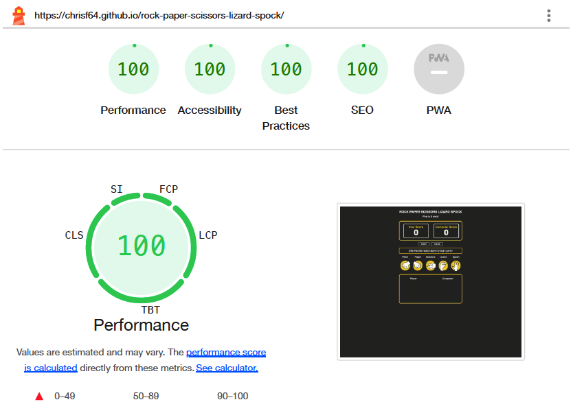

# Rock-Paper-Scissors-Lizard-Spock

[View the live project here](https://chrisf64.github.io/rock-paper-scissors-lizard-spock/)

## Table of Contents
1.  [Introduction](#introduction)
2.  [UX](#ux)
    1.  [Ideal Users](#ideal-users)
    2.  [Development Planes](#development-planes)
    3.  [Design](#design)
3.  [Features](#features)
4.  [Issues and Bugs](#issues-and-bugs)
5.  [Technologies Used](#technologies-used)
    1.  [Main Languages Used](#main-languages-used)
    2.  [Fremeworks, Libraries and Programs Used](#frameworks-libraries--programs-used)
6.  [Testing](#testing)
7.  [Deployment](#deployment)
    1.  [Deploying on GitHub Pages](#deploying-on-github-pages)
8.  [Credits](#credits)
    1.  [Media](#media)
    2.  [Code](#code)
9.  [Acknowledgements](#acknowledgements)

## Introduction
This website is based on the Rock, Paper, Scissors, Lizard, Spock game. The website is an interactive version of the game, where the user can play against the computer. The first to 5 is the winner.

This website based game has been built to complete the second project in the Full Stack Developer course being run by The Code Instute. This project focuses mainly on the use of JavaScript. HTML and CSS have also been used for the structure and styling of the site, and has been set up to be responsive across a range of devices.

## UX
### Ideal Users
Target audience for this game are predominantly fans of The Big Bang Theory, users who will already be familiar with the game. The site is intended to allow them to play the game as it was seen in the show, against a randomised computer choice.

The user goals for new and returning users are the same:
- As a current user, I want to play the game as seen on TV
- As a current and new user, I want the game to have a goal to aim for with a tally of scores
- As a new user, I want to access the rules of the game

### Development-Planes
To develop the web based game in a structured manner the 5 development planes have been considered. Working through them in a systematic manner allows the key building blocks of the site to be in place before fine tuning the aesthetics.

#### Strategy
There are no commercial drivers for this website, it's sole purpose is to provide an interactive game. The only requirements are that the game has an authentic feel which is accurate to the rules of the game.

#### Scope
Based on UX and above strategy, the game requirements are:
- an interactive game area
- a goal to work towards
- a score counter
- feedback after each round
- access to the rules of the game when necessary

#### Structure
The web based game has a very simple structure of just one page, with a modal pop out triggered by a button, which contains the rules of the game.

#### Skeleton
Wireframes were made to showcase the appearance of the site. The wireframes were created using a desktop version of [Balsamiq](https://balsamiq.com/).

## Surface:
Once the structure and wireframe have been agreed, the look and feel of the site can be developed. This may need to align to branding but in the case of this site there are no commercial requirements. 

[Back to top](#rock-paper-scissors-lizard-spock)

## Design
#### Colour Scheme
The colour scheme chosen is a charcoal grey background, and a deep yellow and white for icons, buttons and borders. The charcoal grey is easy on the eye and accentuates the deep yellow and white, easily attracting the eye.

### Typography
The font used throughout the site is [Nunito](https://fonts.google.com/specimen/Nunito). A backup of sans-serif has been applied in case of font import failure.

### Imagery
The modal / rules image was created by the developer in Adobe Illustrator, using icons found free on Google images. Similarly, the icons for each choice of Rock, Paper, Scissors, Lizard, Spock were found free on Google image and colours modified for use on this site.

[Back to top](#rock-paper-scissors-lizard-spock)

## Features
The game page has been split into several sections which has distinct purposes. See image below for diagram:

### Score counter area: 
The scores are displayed here in a simple counter.

### Button area:
This area has 4 buttons in total, shown at different time points within the game. 
- Rules: The "rules" button is always displayed and links to a modal. 
- Start: "Start" must be clicked by the player before the game can start. The reset functionality is locked until this button is clicked.
- Quit: Once the game starts, the start button is replaced with a "quit" button. This is clicked if the player wants to end the game. 
- Reset: Once the game has been played and either player or computer has reached 5 wins, the game will declare the winner. At this point the "quit" button is replaced with the reset button which which must be clicked to begin a new game.

### Results and Feedback area:
This provides instructions and feedback to the player. 
Upon loading the game the instruction is provided to click the "start" button. 
Once the "start" button is clicked, the instruction is provided to make a choice using the 5 image buttons. 
As soon as the first choice is made this area then becomes feedback on the results of each round.
When one of the players reaches 5 the box colour fills red or green and declares the final winner with an instruction to click the reset button. 

### User Choice area: 
This area becomes usable once the start button has been clicked. The player can then click on their chosen image. The cursor changes to indicate a clickable link and when hovering over any image, it increases in size to make the choice clear. 

### Game area:
The player and computer choices are displayed here next to each other for each round. 

[Back to top](#rock-paper-scissors-lizard-spock)

## Issues and Bugs 
During testing, it was discovered that although the game was set to finish when either player or computer reaches a score of 5, the winner was not declared until the next round was played. If the next round was a draw, another round needed to be played until either player or computer won. This was easily remedied by adjusting the function assigned to updating the score and setting it to check if the current score is equal to the defined max score.

## Technologies Used
### Main Languages Used
- [HTML5](https://en.wikipedia.org/wiki/HTML5 "Link to HTML Wiki")
- [CSS3](https://en.wikipedia.org/wiki/Cascading_Style_Sheets "Link to CSS Wiki")
- [JavaScirpt](https://en.wikipedia.org/wiki/JavaScript "Link to JavaScript Wiki")

### Frameworks, Libraries & Programs Used
- [Google Fonts](https://fonts.google.com/ "Link to Google Fonts")
    - Google fonts was used to import the fonts "Special Elite", "Open Sans", "Oswald" and "Nosifer" into the style.css file. These fonts were used throughout the project.
- [Visual Studio Code](https://code.visualstudio.com/ "Link to Visual Studio Code homepage")
     - Visual Studio Code was used for writing code, commiting, and then pushing to GitHub.
- [GitHub](https://github.com/ "Link to GitHub")
     - GitHub was used to store the project after pushing
- [Balsamiq](https://balsamiq.com/ "Link to Balsamiq homepage")
     - Balsamiq was used to create the wireframes during the design phase of the project.
- [Am I Responsive?](http://ami.responsivedesign.is/# "Link to Am I Responsive Homepage")
     - Am I Responsive was used in order to see responsive design throughout the process and to generate mockup imagery to be used.

[Back to top](#rock-paper-scissors-lizard-spock)

## Testing 
### Common Elements Testing
Landing page:
- Page is being displayed as expected 
- Quit button and Reset button are hidden as expected
- Initial instruction to click the start button displayed as expected 
- Game area is blank as expected
- Scores are both reading 0
  

Start button clicked:
- Start button is replaced with Quit button 
  ![]
- Instruction changes, displaying correct message 
- Game area displaying message in "Computer" choice area with appropriate timer delay 

Game begins with player making first selection, for this instance Player chooses rock, Computer chooses lizard:
- Correct message is displayed with correct border colour 
- Correct images are displayed in the game area
- Player wins and therefore computer score is raised to 1

Game continues until one player reaches 5 wins, for this instance computer wins:
- Results message, game images and score counter checked for each round played
- Correct results message and fill colour displayed for computer winning
- Quit button replaced with reset button
- Player choice buttons locked so game cannot continue

Game reset:
- Upon clicking the reset button, game starts again from the beginning

Quit during game play:
- Upon clicking the quit button, game starts again from the beginning

### Responsiveness 
Using Google Chrome Dev Tools, the responsiveness of the site can be tested through multiple view ports (device emulator). 

### Code Validation
- HTML
  - One error was found whe passing code through the W3C validator - "Error: cannot nest a div inside a span" [W3C validator](https://validator.w3.org/nu/?doc=https%3A%2F%2Fcode-institute-org.github.io%2Flove-running-2.0%2Findex.html)
  This was easily corrected and the site returned no more errors.

- CSS
  - No errors were found when passing through the official [(Jigsaw) validator](https://jigsaw.w3.org/css-validator/validator?uri=https%3A%2F%2Fvalidator.w3.org%2Fnu%2F%3Fdoc%3Dhttps%253A%252F%252Fcode-institute-org.github.io%252Flove-running-2.0%252Findex.html&profile=css3svg&usermedium=all&warning=1&vextwarning=&lang=en#css)

- JavaScript
  - Eight instances of the same error were found when passing .js code through [JSHint, a JavaScript Code Quality Tool](https://jshint.com/) - missing semi-colon.
  These errors were easily fixed and the code then resulted in no more errors.

### Browser Validation
- Chrome 
- Edge
- Opera
- Firefox

The site was tested for responsiveness in all four browsers but more specifically in Chrome, using Developer Tools where it behaved as it should when screen sizes were changed.
The site was then run through Lighthouse with particular focus on Accessibility where it scored 100% throughout:

- Game page

    

### User testing 
My wife, daughter, friends and mentor Koko reviewed the site and documentation and flagged any user experience issues. Their helpful advice throughout the process led to a few small UX changes in order to create a better experience. 

[Back to top](#rock-paper-scissors-lizard-spock)

## Deployment
This project was developed using [GitPod](https://www.gitpod.io/ "Link to GitPod site"), which was then committed and pushed to GitHub using the GitPod terminal.

### Deploying on GitHub Pages
To deploy this page to GitHub Pages from its GitHub repository, the following steps were taken:

1. Log into [GitHub](https://github.com/login "Link to GitHub login page") or [create an account](https://github.com/join "Link to GitHub create account page").
2. Locate the [GitHub Repository](https://github.com/ChrisF64/rock-paper-scissors-lizard-spock "Link to GitHub Repo").
3. At the top of the repository, select Settings from the menu items.
4. Scroll down the Settings page to the "Pages" section.
5. Under "Source" click the drop-down menu labelled "None" and select "Main".
6. Upon selection, the page will automatically refresh meaning that the website is now deployed.
7. Scroll back down to the "Pages" section to retrieve the deployed link.

## Credits 

### Media
- Initial images found free on Google images. Images then manipulated in Adobe Illustrator and colours changed as needed by developer.

### Code 
The developer consulted multiple sites (in particular [StackOverflow](https://stackoverflow.com/ "Link to StackOverflow")) in order to better understand the javascript code they were implementing. Modal was created using a tutorial from [Web Dev Simplified](https://www.youtube.com/@WebDevSimplified) youtube channel.

## Acknowledgements
- I want to thank my mentor Koko, for her invaluable help and guidance.

[Back to top](#rock-paper-scissors-lizard-spock)
